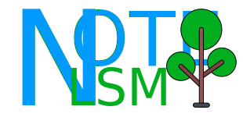
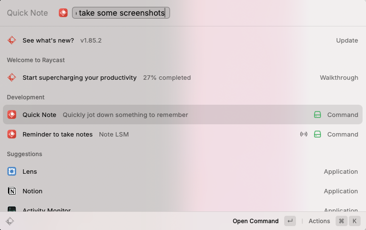
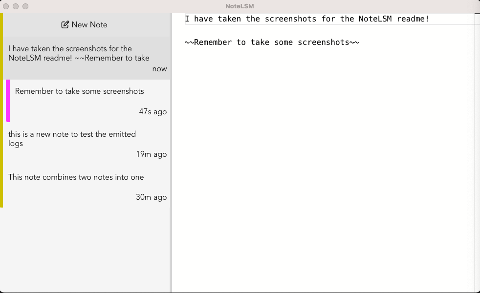

# NoteLSM

NoteLSM is a way of structuring notes that I want to try. This tool is very much intended for myself only, but feel free to try it out yourself. There are no installation instructions, however.

The "LSM" in the name is the key insight to how this tool works. LSM (or LSM-tree) is short for "Log-structured merge-tree".
It's a data-structure made popular by database storage engines. The most notable property of an LSM tree is it's
very fast write performance, given the log-format being append only. The necessary maintenance required is to then merge
logs at a later time, in order to provide more efficient search performance.

This maps directly to my idea for note taking. I want note taking to be _very quick_. I have a raycast keybinding set up to
take a very quick note. This note should not be longer than a sentence (and as such, the prompt window text-box is small).
Notes are append-only, so I cannot edit them either. This is to help me stay in the flow and not dwell on any mistakes.
At a later time, I can review my notes, merging them into a larger note with the tauri-based desktop app.

Since notes are append-only, I'm also utilising [atuin.sh](https://atuin.sh/)'s "generic record sync" feature as
the database for the notes. This automatically gets me e2e encrypted backups and sync between machines.

## Example flows

### Meetings

You are in a meeting, and your manager just asked you if you could do some task. You quickly write it in a note.
5 minutes later, in the same meeting, it was determined the task is no longer needed.
After the meeting, you review the notes, create a new note summarising the meeting suggesting that no action was needed.

### Programming

While in the middle of writing some new code, you realise that it needs refactoring. You don't want
to distract yourself with the refactor now so you leave a quick note.
You leave several of these notes during the span of a couple hours of focus time.

Once you finish your focus, you can step back and open the note app to review.

### Daily/Weekly summaries

At the end of the week, you might have taken hundreds of notes. To help you keep the notes structured,
you might merge notes into daily/weekly categories. This reduces the overall amount of notes you need to review.

## Screenshots

